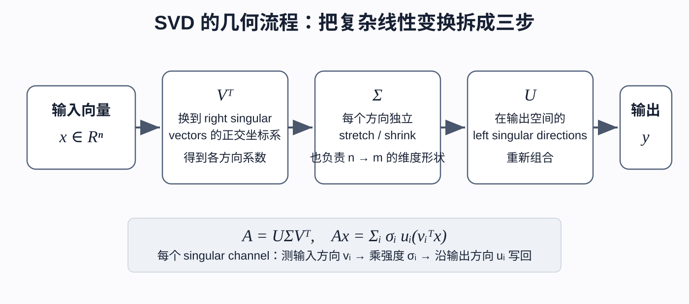
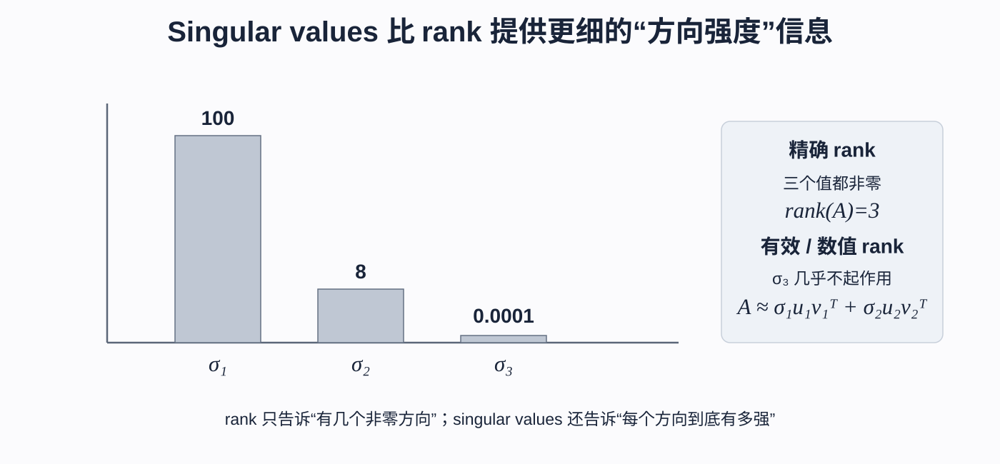
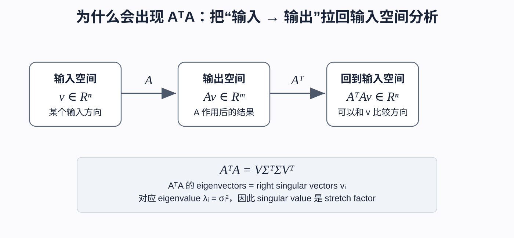
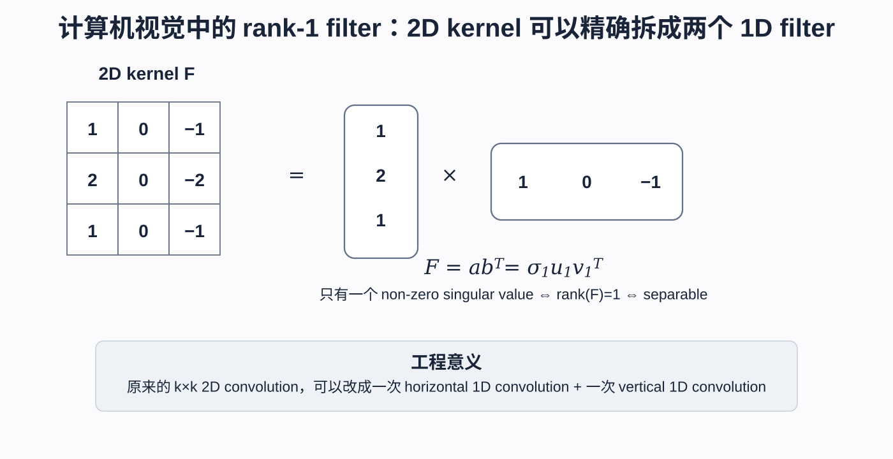
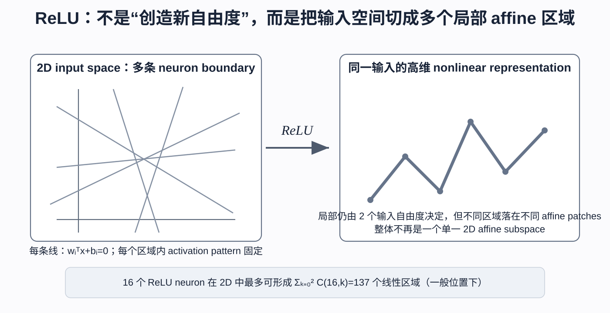
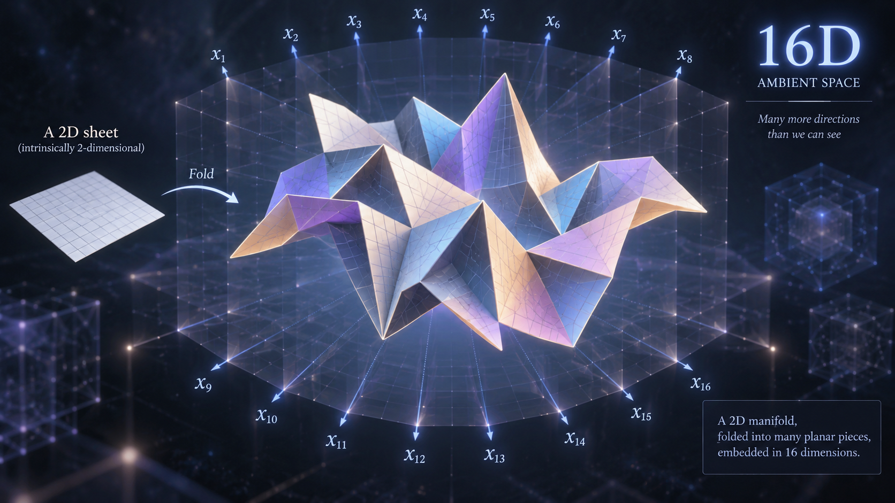

# 从 SVD 到神经网络：用几何直觉理解矩阵、卷积、升维与 ReLU

**作者：Jacky Huo、Jingcheng Liang、ChatGPT**

我第一次学 SVD 时，记住的是一个公式：

$$
A=U\Sigma V^{\top}.
$$

但只会背公式并没有解决真正的困惑。为什么一定是这三个矩阵？奇异值到底“奇异”在哪里？讲 SVD 时为什么总会突然冒出 $A^{\top}A$？更重要的是，这些东西和卷积、隐藏层、ReLU 又有什么关系？

这篇笔记就是沿着这些问题写下来的。它不打算从向量和矩阵乘法重新讲起，而是想建立一条比较连贯的直觉：**矩阵负责重新组织方向和强度，非线性则让不同输入区域走上不同的局部规则。**

如果你也曾经觉得“每个概念单独都懂，放在一起却连不起来”，希望这篇笔记能帮你把它们串成一张图。

## 目录

1. [SVD 究竟拆开了什么](#1-svd-究竟拆开了什么)
2. [把 SVD 想成三个连续动作](#2-把-svd-想成三个连续动作)
3. [升维和降维发生在哪一步](#3-升维和降维发生在哪一步)
4. [奇异值比秩多告诉了我们什么](#4-奇异值比秩多告诉了我们什么)
5. [为什么总要研究转置乘原矩阵](#5-为什么总要研究转置乘原矩阵)
6. [SVD 与特征分解怎样接上](#6-svd-与特征分解怎样接上)
7. [一个很漂亮的应用：可分离卷积核](#7-一个很漂亮的应用可分离卷积核)
8. [SVD 加速与 FFT 加速不是一回事](#8-svd-加速与-fft-加速不是一回事)
9. [用 SVD 重新看神经网络的线性层](#9-用-svd-重新看神经网络的线性层)
10. [二维输入为什么还要升到十六维](#10-二维输入为什么还要升到十六维)
11. [ReLU 的非线性到底来自哪里](#11-relu-的非线性到底来自哪里)
12. [十六个神经元为什么能切出更多区域](#12-十六个神经元为什么能切出更多区域)
13. [“把二维纸折进高维空间”这个比喻](#13-把二维纸折进高维空间这个比喻)
14. [顺着这条直觉再看 Hessian](#14-顺着这条直觉再看-hessian)
15. [几个容易混淆的地方](#15-几个容易混淆的地方)
16. [最后留在脑子里的图景](#16-最后留在脑子里的图景)

---

## 1. SVD 究竟拆开了什么

先从最熟悉的形式开始。给定任意实矩阵

$$
A\in\mathbb R^{m\times n},
$$

它的完整奇异值分解写作

$$
A=U\Sigma V^{\top},
$$

其中

$$
U\in\mathbb R^{m\times m},\qquad
\Sigma\in\mathbb R^{m\times n},\qquad
V\in\mathbb R^{n\times n}.
$$

$U$ 和 $V$ 都是正交矩阵：

$$
U^{\top}U=UU^{\top}=I,\qquad
V^{\top}V=VV^{\top}=I.
$$

$V$ 的列是右奇异向量，$U$ 的列是左奇异向量；$\Sigma$ 是矩形“对角”矩阵，对角线上的非负数 $\sigma_1,\sigma_2,\ldots$ 就是奇异值。

这些定义当然要知道，但真正值得记住的不是“三个矩阵分别叫什么”，而是下面这句话：

> SVD 在输入空间和输出空间中各找出一组最自然的方向，让一个复杂的线性变换变成若干互不干扰的一维缩放。

换句话说，SVD 没有改变矩阵做的事情，只是为它找到了一种更容易看懂的坐标语言。

---

## 2. 把 SVD 想成三个连续动作

把矩阵作用在向量上：

$$
y=Ax=U\Sigma V^{\top}x.
$$

从右往左读，它正好对应三个动作。

### 第一步：分析输入方向

$V$ 的列 $v_1,\ldots,v_n$ 构成一组正交归一方向，因此

$$
V^{\top}x=
\begin{bmatrix}
v_1^{\top}x\\
v_2^{\top}x\\
\vdots
\end{bmatrix}.
$$

这里的每个 $v_i^{\top}x$ 都在回答同一个问题：输入 $x$ 沿方向 $v_i$ 有多少成分？

如果保留完整的 $V$，这一步只是换坐标，并没有降维。只有在截断 SVD 中丢掉一部分方向时，它才带有“投影到低维子空间”的含义。

### 第二步：给每个方向调音量

令 $c=V^{\top}x$，那么 $\Sigma c$ 会把第 $i$ 个系数乘上 $\sigma_i$：

- $\sigma_i>1$，这个方向被放大；
- $0<\sigma_i<1$，这个方向被压缩；
- $\sigma_i=0$，这个方向完全消失。

我觉得把奇异值想成“每个方向自己的音量旋钮”很有帮助。方向由奇异向量指定，音量由奇异值决定。

### 第三步：在输出空间重新组合

最后，$U$ 把调好音量的各个分量沿输出方向 $u_1,u_2,\ldots$ 重新拼起来。

于是整件事可以展开成

$$
\boxed{
Ax=\sum_i\sigma_i u_i\left(v_i^{\top}x\right)
}.
$$

现在再读这个式子就很自然了：先测量输入沿 $v_i$ 的成分，再乘上通道强度 $\sigma_i$，最后沿 $u_i$ 写回输出空间。

---

## 3. 升维和降维发生在哪一步

这里有个很容易被方阵例子掩盖的细节：$\Sigma$ 不一定是方阵。

如果 $A\in\mathbb R^{m\times n}$，那么完整 SVD 中

$$
\Sigma\in\mathbb R^{m\times n}.
$$

整个维度变化是

$$
\mathbb R^n
\xrightarrow{V^{\top}}
\mathbb R^n
\xrightarrow{\Sigma}
\mathbb R^m
\xrightarrow{U}
\mathbb R^m.
$$

所以 $V^{\top}$ 只在输入空间里换坐标，$U$ 只在输出空间里重新组合；真正把形状从 $n$ 维变成 $m$ 维的是矩形的 $\Sigma$。

例如 $A\in\mathbb R^{3\times2}$ 时，

$$
\Sigma=
\begin{bmatrix}
\sigma_1&0\\
0&\sigma_2\\
0&0
\end{bmatrix}.
$$

它把二维坐标 $(c_1,c_2)$ 放进三维空间：

$$
\begin{bmatrix}c_1\\c_2\end{bmatrix}
\longmapsto
\begin{bmatrix}\sigma_1c_1\\\sigma_2c_2\\0\end{bmatrix}.
$$

注意，这只是把二维对象嵌入三维环境，并没有凭空创造第三个独立自由度。

反过来，若 $A\in\mathbb R^{2\times3}$，则

$$
\Sigma=
\begin{bmatrix}
\sigma_1&0&0\\
0&\sigma_2&0
\end{bmatrix}.
$$

第三个奇异坐标无法传到输出，这时才真的发生了压缩。

---

## 4. 奇异值比秩多告诉了我们什么

SVD 给秩提供了一个非常直观的解释：

$$
\operatorname{rank}(A)=\text{非零奇异值的数量}.
$$

但秩只给出“有或没有”，它不告诉我们每个方向有多重要。

假设三个奇异值分别是

$$
\sigma_1=100,\qquad \sigma_2=8,\qquad \sigma_3=0.0001.
$$

严格来说 $\operatorname{rank}(A)=3$，但第三个方向几乎不起作用。工程上，我们很可能直接使用

$$
A\approx
\sigma_1u_1v_1^{\top}+
\sigma_2u_2v_2^{\top}.
$$

这就是低秩近似的核心直觉：保留声音最大的几个方向，忽略几乎听不见的方向。

因此我会这样区分两者：**秩告诉我们有多少个非零方向，奇异值则告诉我们每个方向究竟有多强。** 在真实数据和浮点计算中，奇异值很少恰好等于零，所以“数值秩”或“有效秩”往往比精确的秩更有用。

---

## 5. 为什么总要研究转置乘原矩阵

初学 SVD 时，$A^{\top}A$ 的出现很像一个为了推导而硬凑出来的技巧。换一个角度看，它其实非常自然。

设

$$
A:\mathbb R^n\rightarrow\mathbb R^m.
$$

我们想知道：$A$ 对输入方向 $x$ 的拉伸有多强？最直接的量当然是输出长度：

$$
\|Ax\|_2^2
=(Ax)^{\top}(Ax)
=x^{\top}A^{\top}Ax.
$$

所以 $A^{\top}A$ 描述的正是 $A$ 对输入空间中不同方向的拉伸强度。

而且，当 $A$ 是矩形矩阵时，不能直接用

$$
Av=\lambda v
$$

研究输入方向，因为 $v\in\mathbb R^n$，而 $Av\in\mathbb R^m$，两边甚至不在同一个空间。相比之下，

$$
A^{\top}A:\mathbb R^n\rightarrow\mathbb R^n
$$

把问题带回了输入空间，于是我们终于可以在那里做特征分解。

---

## 6. SVD 与特征分解怎样接上

由

$$
A=U\Sigma V^{\top}
$$

可得

$$
A^{\top}=V\Sigma^{\top}U^{\top}.
$$

两式相乘，并利用 $U^{\top}U=I$：

$$
\boxed{
A^{\top}A=V\Sigma^{\top}\Sigma V^{\top}
}.
$$

这正是对称矩阵的特征分解形式。因此：

$$
\boxed{
A^{\top}A\text{ 的特征向量就是 }A\text{ 的右奇异向量}
}
$$

并且

$$
\boxed{
\lambda_i(A^{\top}A)=\sigma_i^2
}.
$$

这也解释了奇异值为什么代表拉伸强度。若 $v_i$ 是单位右奇异向量，那么

$$
\|Av_i\|_2^2
=v_i^{\top}A^{\top}Av_i
=\sigma_i^2,
$$

所以

$$
\|Av_i\|_2=\sigma_i.
$$

也就是说，$v_i$ 是一个特殊的输入方向，而 $\sigma_i$ 就是 $A$ 沿这个方向的伸缩倍数。同理，$AA^{\top}$ 的特征向量就是 $U$ 的列。

---

## 7. 一个很漂亮的应用：可分离卷积核

SVD 在计算机视觉里有个非常直观的落点。

对二维卷积核 $F$ 做 SVD：

$$
F=U\Sigma V^{\top}
=\sum_i\sigma_i u_iv_i^{\top}.
$$

如果只有 $\sigma_1$ 非零，那么

$$
F=\sigma_1u_1v_1^{\top},\qquad
\operatorname{rank}(F)=1.
$$

于是 $F$ 可以写成两个一维向量的外积 $F=ab^{\top}$。

例如经典的 Sobel 核：

$$
\begin{bmatrix}
1&0&-1\\
2&0&-2\\
1&0&-1
\end{bmatrix}
=
\begin{bmatrix}1\\2\\1\end{bmatrix}
\begin{bmatrix}1&0&-1\end{bmatrix}.
$$

原本的一次二维卷积，现在可以拆成一次水平方向的一维卷积，再做一次竖直方向的一维卷积。对 $k\times k$ 卷积核来说，每个位置的乘法次数会从大约 $k^2$ 降到 $2k$。

这里有一个边界必须说清楚：并非所有卷积核都能精确拆成一对一维卷积核。若 $F$ 的秩为 $r$，它需要写成 $r$ 个可分离项的和：

$$
F=\sum_{i=1}^{r}\sigma_i u_iv_i^{\top}.
$$

只有后面的奇异值足够小时，我们才能只保留前几个分量，得到近似的可分离结构。

---

## 8. SVD 加速与 FFT 加速不是一回事

SVD 和 FFT 都可能让卷积更快，但它们利用的结构完全不同。

SVD 问的是：**卷积核本身是否接近低秩？** 如果 $F\approx ab^{\top}$，就把一个二维卷积拆成两个一维卷积。

FFT 问的则是：**能否换到频域，让卷积变成逐元素乘法？** 卷积定理告诉我们

$$
\mathcal F(I*F)=\mathcal F(I)\odot\mathcal F(F).
$$

因此可以先对输入和卷积核做 FFT，在频域逐元素相乘，再做逆 FFT。

小卷积核（例如 $3\times3$）通常适合直接在空间域计算；非常大的卷积核或长信号更可能从 FFT 中受益。记忆时只需抓住这条分界：**SVD 利用低秩结构，FFT 利用卷积定理。**

---

## 9. 用 SVD 重新看神经网络的线性层

神经网络最普通的一层是

$$
z=Wx+b.
$$

先暂时忽略偏置，把权重矩阵分解：

$$
Wx=U\Sigma V^{\top}x
=\sum_i\sigma_i u_i\left(v_i^{\top}x\right).
$$

刚才建立的直觉现在可以原封不动地搬过来：$V^{\top}$ 分析当前表示里的特殊输入方向，$\Sigma$ 放大、压缩或删除某些方向，$U$ 再把它们组合成新的隐藏表示。

每个 $i$ 都像一条方向通道，依次问三个问题：

1. 输入中有多少这样的特征组合？
2. 这一层对它有多敏感？
3. 应该把它写到输出空间的哪个方向？

不过不要把这个视角误解成网络前向传播时真的会先计算 SVD。通常它不会。SVD 是我们分析训练后权重矩阵的一副“几何眼镜”。

---

## 10. 二维输入为什么还要升到十六维

假设输入 $x\in\mathbb R^2$，第一层有 16 个神经元：

$$
z=Wx+b,\qquad W\in\mathbb R^{16\times2}.
$$

输出当然位于 $\mathbb R^{16}$，但如果没有激活函数，所有可能的 $z$ 仍然只落在至多二维的仿射子空间里，因为

$$
\operatorname{rank}(W)\le2.
$$

所以线性的 $2\rightarrow16$ 并没有把两个自由度变成十六个独立自由度。

那宽度还有什么用？答案是：它给同一个输入准备了 16 种可学习的测量方式：

$$
z_i=w_i^{\top}x+b_i.
$$

每个神经元可以从不同方向观察输入，设置不同阈值，寻找不同的特征组合。隐藏层的宽度不是在创造原始信息，而是在建立更丰富的特征坐标。

---

## 11. ReLU 的非线性到底来自哪里

现在把 ReLU 放回来：

$$
h=\operatorname{ReLU}(Wx+b).
$$

对第 $i$ 个神经元，

$$
h_i(x)=\max(0,w_i^{\top}x+b_i).
$$

在二维输入空间中，$w_i^{\top}x+b_i=0$ 是一条直线。直线一侧的神经元被激活，另一侧的输出则被压成零。

在某个激活模式不变的区域里，我们可以用对角掩码 $D$ 表示各神经元的开关状态：

$$
\operatorname{ReLU}(W_1x+b_1)=D(W_1x+b_1).
$$

若后面再接一层线性输出，

$$
f(x)=W_2\operatorname{ReLU}(W_1x+b_1)+b_2,
$$

那么在这个区域中

$$
f(x)=W_2DW_1x+W_2Db_1+b_2
=A_{\text{region}}x+c_{\text{region}}.
$$

这就是 ReLU 网络“分段线性”的确切含义：**每一小块内部仍是仿射变换，但不同区域使用不同的仿射规则。** 非线性不是来自某一块内部，而是来自这些规则在区域边界处发生切换。

---

## 12. 十六个神经元为什么能切出更多区域

一个神经元并不等于一个区域。它更像一把刀，在二维输入空间里切出一条边界。多条边界彼此交叉后，区域数会组合式增长。

对二维输入，$n$ 条处于一般位置的直线最多能产生

$$
\sum_{k=0}^{2}{n\choose k}
=1+n+\frac{n(n-1)}{2}
$$

个区域。代入 $n=16$：

$$
1+16+120=137.
$$

因此 16 个 ReLU 神经元最多可以切出 137 个线性区域。每个区域对应一组固定的开关模式，也对应一套固定的局部仿射变换。

区域和特征也不是同一个概念：特征是某个神经元的输出 $h_i(x)$；区域则是一类触发了相同开关组合的输入。

---

## 13. “把二维纸折进高维空间”这个比喻

到这里，“把一张二维纸折进十六维空间”的说法就比较容易理解了。

输入本来只有两个自由度；线性的 $2\rightarrow16$ 先把它嵌入十六维环境；ReLU 再根据输入所在区域选择不同的掩码。于是不同区域被送往不同方向的仿射片段。

局部来看，每个片段仍然至多是二维的；整体来看，它们却不再位于同一个二维仿射平面。把它想象成一张被折出许多折痕的纸，是很有用的几何直觉。

不过这个比喻不能推得太远。ReLU 可能把某些方向压成零，导致局部维度下降；不同区域也可能重叠、自交或丢失信息。因此这是一幅帮助思考的图，而不是所有 ReLU 网络都满足的严格流形描述。

---

## 14. 顺着这条直觉再看 Hessian

SVD 和特征分解背后有一条很通用的思路：在高维问题中寻找自然方向，再观察每个方向的强度。

这套语言同样适用于优化。在极小值附近，损失函数的二阶结构由 Hessian 描述：

$$
H=\nabla^2L(\theta).
$$

如果

$$
Hv_i=\lambda_i v_i,
$$

那么 $v_i$ 是参数空间中的一个特殊方向。较大的 $\lambda_i$ 意味着损失沿该方向上升得快，地形较尖；较小的 $\lambda_i$ 对应较平的方向；接近零的特征值则可能暗示冗余、对称性或非常平坦的区域。

神经网络里确实存在大量参数对称性。例如，交换两个隐藏神经元，并同步交换下一层对应的连接，网络表示的函数不会改变。ReLU 还有正比例缩放对称性：

$$
a\,\operatorname{ReLU}(w^{\top}x)
=\frac{a}{c}\operatorname{ReLU}(cw^{\top}x),\qquad c>0.
$$

所以不同参数点可能表示完全相同的函数，损失地形也会出现等价解和平坦方向。

但“神经网络容易训练，是因为对称性带来了许多最优解”仍然是过度概括。过参数化、梯度动力学、归一化、网络结构和数据本身都会影响优化；对称性只是其中一块拼图。

---

## 15. 几个容易混淆的地方

### 完整的坐标变换不等于降维

完整 SVD 中的 $V^{\top}$ 是正交坐标变换，不会丢失信息。只有截断并舍弃部分奇异方向时，才发生投影和压缩。

### 矩形矩阵的中间项也是矩形的

若 $A\in\mathbb R^{m\times n}$，完整 SVD 中的 $\Sigma$ 就属于 $\mathbb R^{m\times n}$，并不总是 $n\times n$。

### 升到高维不等于创造独立信息

二维输入经过纯线性映射后，仍然最多只有两个独立自由度。更宽的隐藏空间提供的是更丰富的特征坐标。

### ReLU 创造的是表达能力，不是原始信息

如果两个输入在 ReLU 之前已经变成完全相同的表示，后续确定性激活函数无法恢复丢失的信息。ReLU 的价值是切换局部规则，而不是凭空增加信息。

### “负半边归零”不等于删除输入点

ReLU 只是把某个神经元在负区域的输出压成零。输入点仍然存在，其他神经元也可能从不同方向保留它的信息。

### 精确可分离与近似低秩要分开

精确可分离要求 $\operatorname{rank}(F)=1$，也就是只有一个奇异值非零。若后续奇异值只是很小，只能说这个卷积核近似可分离。

---

## 16. 最后留在脑子里的图景

写到最后，我会把整篇笔记压缩成下面几句话。

SVD 做了三件事：

$$
\text{分析输入方向}
\longrightarrow
\text{逐方向缩放}
\longrightarrow
\text{在输出空间重组}.
$$

奇异值让我们看见每个方向的强弱；$A^{\top}A$ 把矩阵的拉伸作用带回输入空间；秩为一的卷积核因此可以拆成两个一维卷积。

把同一副眼镜戴到神经网络上，线性层是在重新组织表示的方向和强度，隐藏层宽度是在为同一输入准备更多可学习的特征坐标，而 ReLU 则根据输入位置切换当前生效的线性规则。

所以，线性代数与神经网络之间并没有一道突然出现的鸿沟。前者寻找更聪明的坐标系，让高维变换暴露出少数重要方向；后者在这些线性变换之间加入非线性，让不同输入区域可以被不同方式重新编码。

---

## 参考资料与说明

本文的线性代数部分主要参考 Goodfellow、Bengio 与 Courville 的 *Deep Learning* 第 2 章中关于正交矩阵、特征分解、SVD、伪逆与 PCA 的内容。ReLU 的分段仿射几何、隐藏层宽度、卷积可分离性、FFT，以及 Hessian 与参数对称性等内容，用来补上这些线性代数概念与机器学习实践之间的直觉联系。
